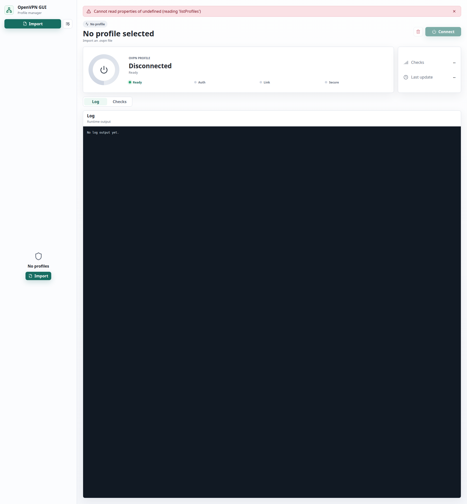

# OpenVPN GUI

**A desktop VPN profile manager for Linux — import, connect, and monitor
OpenVPN profiles with ease.*

[](LICENSE)
[]()
[]()
[]()
[](https://github.com/berlinify/openvpn-gui/releases)
[](https://github.com/berlinify/openvpn-gui/releases/download/Stable/openvpn-gui_0.2.0_amd64.deb)

---

## Table of Contents

- [Features](#features)
- [Quick Start](#quick-start)
- [Screenshots](#screenshots)
- [Tech Stack](#tech-stack)
- [Architecture](#architecture)
- [Development](#development)
- [Debian Package](#debian-package)
- [Runtime Dependencies](#runtime-dependencies)
- [Security Notes](#security-notes)
- [Contributing](#contributing)

---

## Features

### 🛡️ Profile Management

Import `.ovpn` files through the native file picker. The app automatically
copies all referenced files — `ca`, `cert`, `key`, `tls-auth`, `tls-crypt`,
`auth-user-pass`, and more — into a private per-profile directory, keeping
everything self-contained and organized.

When a profile uses `auth-user-pass` without an embedded file, you're prompted
for your username and password. Secret keys and private-key passphrases can
optionally be remembered per profile, so you don't have to re-enter them on
every connection.

### 🔌 Connection Management

Connections prioritize **OpenVPN 3 Linux** (`openvpn3`) for modern session
management via D-Bus. If OpenVPN 3 is unavailable, the app gracefully falls
back to **OpenVPN 2** using `pkexec` and a packaged privileged helper.

Start, stop, and check connection status with a single click. Failed startup
attempts display the full command output, exit code, stderr, and log tail to
help you diagnose issues quickly.

### 📡 Monitoring

A live connection panel shows the current state — Connected, Connecting,
Disconnected, or error conditions like TLS errors or authentication failures.
Below it, a real-time log tail streams OpenVPN output, and a connectivity
checks panel pings endpoints (Vercel, Google, GitHub, GitHub API, npm registry)
to confirm your tunnel is working.

### 🔒 Security

Credentials and secret keys are stored securely under
`~/.config/openvpn-gui/profiles/` with `chmod 600` permissions. The OpenVPN 2
privileged helper validates that all config, credential, and secret files reside
within the user's profile directory before running OpenVPN as root. A PolicyKit
action restricts the helper to only authorized operations.

---

## Quick Start

### One-Command Install

```bash
curl -fsSL https://raw.githubusercontent.com/berlinify/openvpn-gui/main/install.sh | sudo sh
```

This downloads and runs the automated installer, which:

1. Installs all system dependencies (`python3`, `iputils-ping`, `policykit-1`,
   `openvpn3`, `openvpn`)
2. Downloads the latest `.deb` release from GitHub
3. Installs the package via `dpkg`

### Manual Install

```bash
# Download the latest release
wget https://github.com/berlinify/openvpn-gui/releases/download/Stable/openvpn-gui_0.2.0_amd64.deb

# Install it
sudo dpkg -i openvpn-gui_0.2.0_amd64.deb
sudo apt-get install -f

# Launch from your application menu or via terminal
openvpn-gui
```

Once launched, click **Import**, select a `.ovpn` file, and click **Connect**.

---

## Screenshots



---

## Tech Stack


| Layer       | Technology                          |
|-------------|-------------------------------------|
| Frontend    | Electron + React 19 + TypeScript    |
| Build       | Vite 7 + Electron Forge             |
| Backend     | Python 3 (subprocess JSON bridge)   |
| VPN         | OpenVPN 3 Linux (preferred) / OpenVPN 2 (fallback) |
| Privilege   | pkexec + PolicyKit                  |

---

## Architecture

The application is split into three layers: an **Electron renderer** running a
React/TypeScript UI, a **preload bridge** that exposes a secure IPC API, and a
**Python backend** that handles all OpenVPN operations via JSON over
stdin/stdout.

```
┌─────────────────────────────────────────────────────┐
│                   Electron Window                    │
│  ┌─────────────────────────────────────────────────┐ │
│  │            React / TypeScript UI                │ │
│  │  ┌─────────┐ ┌──────────┐ ┌──────────────────┐ │ │
│  │  │Profile  │ │Status    │ │ Log / Checks     │ │ │
│  │  │Sidebar  │ │Panel     │ │ Panel            │ │ │
│  │  └────┬────┘ └────┬─────┘ └────────┬─────────┘ │ │
│  └───────┼───────────┼────────────────┼────────────┘ │
│          │   IPC     │                │              │
│  ┌───────┴───────────┴────────────────┴────────────┐ │
│  │              Preload Bridge                      │ │
│  └───────────────────┬─────────────────────────────┘ │
└──────────────────────┼───────────────────────────────┘
                       │  JSON stdin/stdout
┌──────────────────────┴───────────────────────────────┐
│              Python Backend (electron_bridge.py)      │
│  ┌─────────────┐  ┌────────────┐  ┌───────────────┐ │
│  │ Controller  │  │ Profiles   │  │Network Checks │ │
│  └──────┬──────┘  └─────┬──────┘  └───────┬───────┘ │
└─────────┼───────────────┼──────────────────┼─────────┘
          │               │                  │
┌─────────▼───────────────▼──────────────────▼─────────┐
│                  OpenVPN Layer                         │
│  ┌─────────────────┐    ┌───────────────────────────┐ │
│  │ OpenVPN 3 (D-Bus)│    │ OpenVPN 2 (pkexec +      │ │
│  │ Preferred path   │    │ Privileged Helper)        │ │
│  └─────────────────┘    └───────────────────────────┘ │
└───────────────────────────────────────────────────────┘
```

The Electron main process spawns the Python backend as a child process and
communicates over JSON messages on stdin/stdout. The preload script (loaded
with `contextIsolation: true` and `sandbox: true`) exposes a typed API to the
renderer via `contextBridge`. The Python backend detects OpenVPN 3 availability
at runtime and routes connections through either `openvpn3` (D-Bus session) or
`openvpn` (via `pkexec` + the privileged helper).

---

## Development

Install Node dependencies, then launch the Electron app in development mode:

```bash
yarn install
yarn dev
```

### Project Structure

```
├── electron/           Electron main process (IPC handlers, window)
│   └── main.ts
├── renderer/           React / TypeScript frontend
│   └── src/
│       ├── App.tsx     Main application component
│       ├── main.tsx    Entry point
│       └── styles.css  Application styles
├── src/
│   └── openvpn_gui/    Python backend
│       ├── electron_bridge.py   JSON IPC endpoint
│       ├── controller.py        OpenVPN session management
│       ├── importer.py          .ovpn profile importer
│       ├── profiles.py          Profile data model + persistence
│       ├── paths.py             File system paths
│       └── network_checks.py    Connectivity ping checks
├── shared/
│   └── vpn.ts          Shared TypeScript types
├── scripts/
│   ├── openvpn-gui-helper    Privileged helper for OpenVPN 2
│   └── check-deb-tools.sh    Debian packaging prerequisites
└── packaging/          Debian package lifecycle scripts
```

The Electron frontend communicates with the Python backend through a small JSON
bridge (`electron_bridge.py`). The backend automatically resolves its source
path whether running from source or from a packaged `.deb` install.

To typecheck the TypeScript code:

```bash
yarn typecheck
```

---

## Debian Package

Build a redistributable `.deb` package for Debian-based Linux distributions.

### Prerequisites

```bash
sudo apt install dpkg fakeroot
```

### Build

```bash
yarn make:deb
```

Or, using the shell script directly:

```bash
./build-deb.sh
```

Forge writes release artifacts to `out/make/`. The Electron package includes:

- The Python backend and all Python source files
- The privileged helper (`openvpn-gui-helper`) at
  `/usr/lib/openvpn-gui/resources/scripts/`
- A PolicyKit action installed by the Debian post-install script at
  `/usr/share/polkit-1/actions/com.openvpngui.helper.policy`

The installed launch wrapper forces the system GSettings schema cache, which
avoids Snap-injected GNOME schema mismatches (such as the missing
`font-antialiasing` key).

---

## Runtime Dependencies

| Dependency | Required | Notes |
|---|---|---|
| `python3` | ✅ | Backend runtime |
| `iputils-ping` | ✅ | Connectivity checks |
| `openvpn3-client` or `openvpn3` | Recommended | Primary OpenVPN provider via D-Bus |
| `openvpn` | Fallback | Used when OpenVPN 3 is unavailable |
| `pkexec` / `policykit-1` ⚠️ | For fallback | OpenVPN 2 privilege escalation |

> ⚠️ `openvpn3` may not be available in all distribution repositories. See the
> [OpenVPN 3 Linux installation guide](https://community.openvpn.net/openvpn/wiki/OpenVPN3Linux)
> for setup instructions. The app works without it, falling back to OpenVPN 2.

---

## Security Notes

**OpenVPN 3 sessions** run through the user's OpenVPN 3 D-Bus session, which
does not require any elevated privileges. This is the preferred path.

**OpenVPN 2 fallback** uses a privileged helper (`openvpn-gui-helper`)
executed via `pkexec`. The helper performs several safety checks before taking
any action:

- **Path validation:** All config, credential, and secret key file paths are
  resolved and verified to live inside the calling user's
  `~/.config/openvpn-gui/profiles/` directory, preventing path traversal
  attacks.
- **Signal safety:** Before sending signals to a running OpenVPN 2 process, the
  helper verifies that the process's command line matches the expected profile
  configuration path, preventing accidental or malicious signaling of arbitrary
  processes.
- **PolicyKit restriction:** A custom PolicyKit action
  (`com.openvpngui.helper.policy`) controls which operations the helper may
  perform. Users must authenticate via PolicyKit to authorize privileged
  operations.

**Credential and secret key storage:**

- Auth files and secret keys are stored with `chmod 600` permissions in
  `~/.config/openvpn-gui/profiles/<profile-id>/`
- The "Remember for this profile" checkbox persists credentials to `auth.txt`
  and `secret.txt` in the profile directory. When unchecked, credentials are
  written to `runtime-auth.txt` and `runtime-secret.txt`, which are cleaned up
  on disconnect.
- Runtime data (PID files, logs, session paths) is stored under
  `/run/user/$UID/openvpn-gui/`, which is only readable by the owning user.

---

## Contributing

Contributions are welcome!

1. Fork the repository
2. Run `yarn install && yarn dev` to set up the development environment
3. Make your changes and run `yarn typecheck` to verify types
4. Submit a pull request

---

<p align="center">
  <sub>Built with Electron, React, and Python. Licensed under the MIT License.</sub>
</p>
